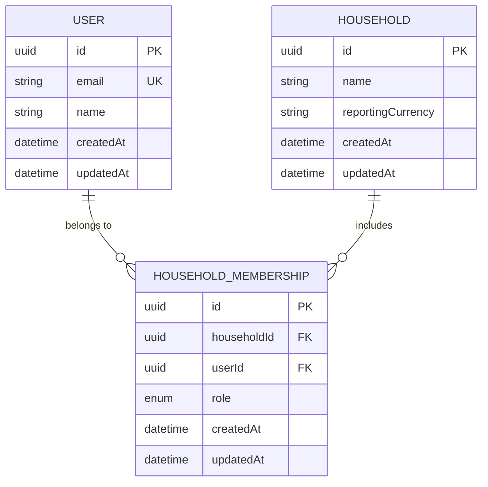

# Database schema

This document visualizes the PostgreSQL schema managed by Prisma in `apps/api/prisma/schema.prisma`.

## Notes

- A `User` can belong to many households through `HouseholdMembership`.
- A `Household` can include many users through `HouseholdMembership`.
- `HouseholdMembership.role` is an enum with values `OWNER` and `MEMBER`.
- A partial unique index on `HouseholdMembership(householdId) WHERE role = 'OWNER'` enforces **at most one OWNER per household**. The application layer ensures a household is created with exactly one OWNER.
- `User.email` is unique and normalized to lowercase by the domain factory.
